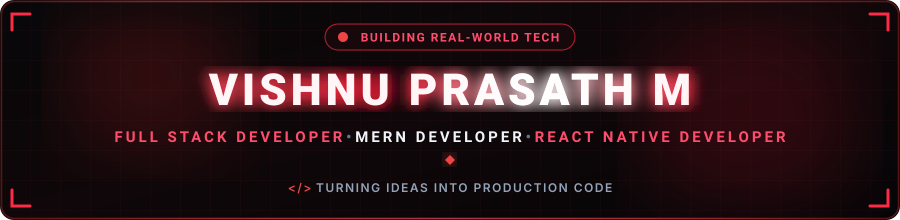

  

  

  
  &nbsp;
  
  &nbsp;
  
  &nbsp;
  
  &nbsp;
  
  &nbsp;
  

  

---

<h2 align="center">🔴 About Me</h2>

  

  

  Hey! I'm <b>Vishnu Prasath M</b>, a passionate <b>Full-Stack Developer</b> based in India. 
  I specialize in building scalable, responsive and user-friendly full-stack web applications using the MERN stack, along with cross-platform mobile applications using React Native.

  
  &nbsp;
  
  &nbsp;
  

  💬 <b>Let's Discuss:</b> React, JavaScript, TypeScript, Node.js, Express.js, MongoDB, PostgreSQL, REST APIs & Modern UI Development. 
  ⚡ <b>Philosophy:</b> <i>"I love turning ideas into fully functional, real-world applications!"</i>

<table width="100%" border="0" align="center">
<tr>
<td width="50%" align="center" style="padding: 14px;">
  <h4>🔭 Flagship Project</h4>
  
<b>Zenvest / Growvest</b> Investment Tracking & Management Platform

</td>

<td width="50%" align="center" style="padding: 14px;">
  <h4>🌱 Active Deep Dives</h4>
  
<b>Full-Stack Development</b> React, Node.js, APIs & Database Architecture

</td>
</tr>

<tr>
<td width="50%" align="center" style="padding: 14px;">
  <h4>📱 Mobile Developer</h4>
  
<b>React Native & Expo</b> Building Cross-Platform Mobile Applications

</td>

<td width="50%" align="center" style="padding: 14px;">
  <h4>🤝 Collaboration</h4>
  
<b>Web, Mobile & Full Stack</b> Open to exciting freelance & development projects

</td>
</tr>
</table>

---

<h2 align="center">🔴 Featured Project Spotlight</h2>

<table width="100%" border="0" align="center">
<tr>
<td align="center" style="padding: 22px;">

<h3>💰 Zenvest / Growvest</h3>

<i>
A full-stack investment tracking platform designed to manage user investments,
deposits, interest earnings, withdrawals, transactions and administrative operations.
</i>

 

  

  

  

</td>
</tr>
</table>

---

<h2 align="center">🧩 LeetCode Problem Solving</h2>

  <i>Live real-time tracker of coding challenges & algorithmic problem-solving milestones.</i>

  

  

  

  

---

<h2 align="center">🛠️ Tech Stack & Skills</h2>

<b>Core Programming Languages</b>

  

<b>Frontend & Mobile Development</b>

  

<b>Backend, Cloud & Databases</b>

  

<b>Development Tools & DevOps</b>

  

  
  &nbsp;
  
  &nbsp;
  
  &nbsp;
  

---

<h2 align="center">📊 GitHub Analytics & Activity</h2>

  
  &nbsp;&nbsp;
  

  

  

---

<h2 align="center">⚡ Contribution Journey</h2>

  

---

<h2 align="center">📬 Let's Connect &amp; Collaborate</h2>

  <i>Whether you want to discuss web development, mobile applications, freelance projects, or just say hello — my inbox is always open!</i>

<table border="0" align="center">
<tr>

<td align="center" width="220" style="padding: 16px;">
  <a href="YOUR_LINKEDIN_URL" target="_blank">
    
      
    
  </a>
   
  <b>Professional Network</b>
</td>

<td align="center" width="220" style="padding: 16px;">
  <a href="YOUR_INSTAGRAM_URL" target="_blank">
    
      
    
  </a>
   
  <b>Social &amp; Tech Content</b>
</td>

<td align="center" width="220" style="padding: 16px;">
  <a href="mailto:YOUR_EMAIL@gmail.com">
    
      
    
  </a>
   
  <b>Direct Collaboration</b>
</td>

</tr>
</table>

  

